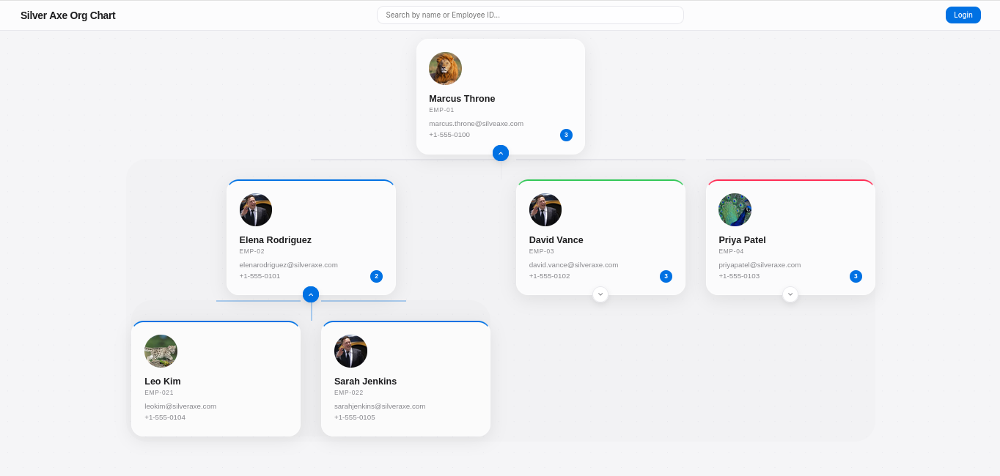

# Hierarchical Vision Chart Web Application

An interactive, modern organizational chart visualization tool inspired by Apple's clean aesthetic. Built with a Flask async backend and an `aiosqlite` database.



## 🚀 Features

- **Expandable Tree View**: Navigate complex hierarchies with smooth, color-coded branch transitions.
- **Branch Color-Coding**: Each major department is assigned a unique "Apple Fruit" color (Blue, Green, Rose, etc.) for easy identification.
- **Interactive Path Highlighting**: Hover over any card to highlight its direct lineage and connection lines.
- **Deep-Dive Search**: Search by name or ID to see immediate subordinates and the full chain of command above.
- **Admin Panel**: Securely Add, Edit, or Delete employees with support for profile picture uploads.

---

## 💻 Setup & Installation

Follow these steps to get the application running on your local machine.

### 1. Create a Virtual Environment

**Windows:**
1. Open PowerShell or Command Prompt in the project folder.
2. Run: `python -m venv .venv`

**macOS / Linux:**
1. Open Terminal in the project folder.
2. Run: `python3 -m venv .venv`

---

### 2. Activate the Virtual Environment

**Windows:**
- PowerShell: `.\.venv\Scripts\Activate.ps1`
- CMD: `.\.venv\Scripts\activate.bat`

**macOS / Linux:**
- Terminal: `source .venv/bin/activate`

---

### 3. Install Requirements
Once the environment is activated (you should see `(.venv)` in your prompt), run:
```bash
pip install -r requirements.txt
```

---

### 4. Configure Environment Variables
Create or edit the `.env` file in the root directory:
```env
SECRET_KEY=any-random-string
ADMIN_ID=admin
ADMIN_PASS=password123
```

---

### 5. Run the Application
```bash
python app.py
```
Visit **`http://localhost:5000`** in your browser.

---

## 📖 How to Use the Application

### Viewing the Hierarchy
- **Expand/Collapse**: Click the **Chevron Arrow (∨)** at the bottom of any card to reveal or hide that person's direct reports.
- **Color Coding**: Notice that each major branch starting from the top has a different color. All subordinates in that branch share the same connection line color.
- **Path Highlighting**: Hover your mouse over any employee card. The lines connecting them to their manager will brighten, helping you trace the reporting line.

### Searching
- Use the **Search Bar** at the top. 
- You can type a **Name** or an **Employee ID** (e.g., `EMP-105`).
- Clicking a search result will show you that person's **Lineage** (who they report to) and their **Direct Reports**.

### Admin Tasks (Adding/Editing)
1. Click the **Login** button in the top right.
2. Enter the **Admin ID** and **Password** from your `.env` file.
3. Once logged in, you will see **Add**, **Edit**, and **Delete** buttons on every card.
4. **Adding**: Click "Add" on a card to create a new subordinate for that person. You can upload a photo or provide a URL.
5. **Editing**: Click "Edit" to update name, email, or profile picture.

---

## 🛠️ Tech Stack
- **Backend**: Flask (Python) with `aiosqlite` for asynchronous DB operations.
- **Frontend**: Vanilla JavaScript (ES6+), CSS3 with Glassmorphism and CSS Variables.
- **Database**: SQLite.
